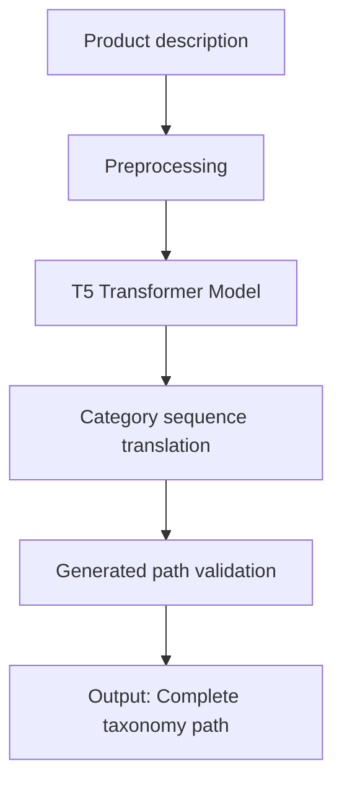

<!-- Language toggle -->

<p align="right">
  <a href="/README.md"> English</a> | <a href="/docs/Readme_es.md"> Español</a>
</p>

---

# 🧠 OntoGen: Semantic Product Categorization via Machine Translation {#english-version}

This project is inspired by the paper **"Don't Classify, Translate: Multi-Level E-Commerce Product Categorization via Machine Translation"** to implement a product categorization system based on neural machine translation models such as T5.

---

## 🤖 Traditional Approach vs. Translation-Based Approach

### Traditional classification

* Focuses on selecting a leaf category from a product description.
* Uses classifiers (SVM, CNN, RNN).
* Limits structure to a single root-to-leaf path.
* No support for alternative or adaptive category paths.

### Our approach

* Reformulates the problem as a **sequence translation task**:

  * **Input:** Product description in natural language.
  * **Output:** Category sequence from root to leaf.
* Uses Transformer-based models (e.g., T5) to generate paths.
* Enables new path generation, transforming the taxonomy into a **directed acyclic graph (DAG)**.

---

## 🔄 System Flow (Mermaid)



---

## 📊 Paper Results

| Model                | RDC Dataset    | Ichiba Dataset |
| -------------------- | -------------- | -------------- |
| DBN+KNN (Classifier) | 73.85 (F1)     | 82.05 (F1)     |
| Transformer (NMT)    | 73.83 (F1)     | **84.74 (F1)** |
| Seq2Seq+Transformer  | **74.19 (F1)** | **84.26 (F1)** |

* The translation-based model is consistently equal or superior.
* Performance degrades less with smaller training data.
* Generates **new paths** enriching the original taxonomy.

---

## 🔍 Product Translation Example

**Input:** "Epson WorkForce Pro Inkjet Printer"

**Expected output:**

```
Electronics → Printing → Printers
```

**Alternative prediction:**

```
Office → Printing → Printers
```

Both are valid, showcasing the model's **contextual understanding**.

---

## 📚 Scientific Reference

> Li, M.Y., Kok, S., & Tan, L. (2018).
> *Don’t Classify, Translate: Multi-Level E-Commerce Product Categorization via Machine Translation*.
> arXiv: [1812.05774](https://arxiv.org/abs/1812.05774)

---

## ✨ Future Contributions

* Integrate structural validation using SKOS/OWL.
* Add support for regional and multi-taxonomies.
* Evaluate user interaction with new paths.
* Optimize with fine-tuning of models like T5-small or mT5.
