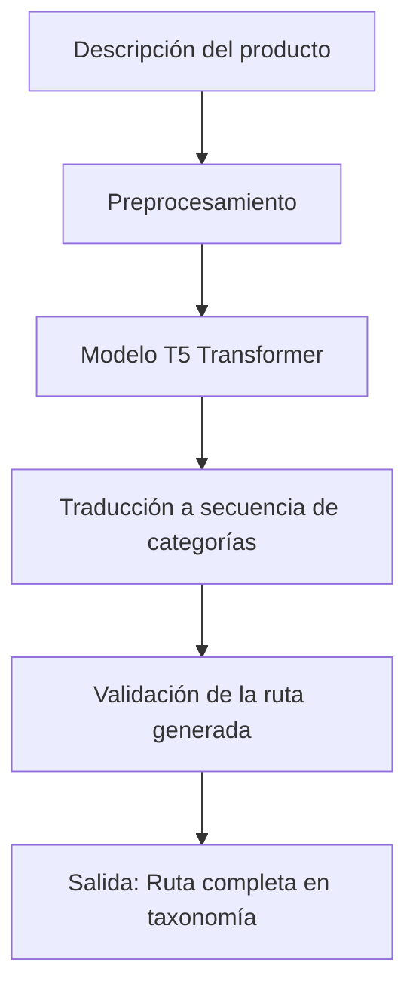

# 🧠 OntoGen: Clasificación Semántica de Productos via Traducción Automática

Este proyecto se inspira en el paper **"Don't Classify, Translate: Multi-Level E-Commerce Product Categorization via Machine Translation"** para implementar un sistema de clasificación de productos basado en modelos de traducción automática como T5.

---

## 🤖 Enfoque Tradicional vs. Enfoque de Traducción

### Clasificación tradicional

* Enfocada en seleccionar una categoría hoja (leaf node) a partir de un texto.
* Utiliza modelos de clasificación (SVM, CNN, RNN).
* Limita la estructura del árbol: un solo camino de la raíz a la hoja.
* No permite caminos alternativos ni adaptabilidad a nuevas categorías.

### Nuestro enfoque

* Reformula el problema como una **tarea de traducción de texto**:

  * **Entrada:** Descripción del producto en lenguaje natural.
  * **Salida:** Secuencia de categorías que forman una ruta desde la raíz a la hoja.
* Utiliza modelos tipo Transformer (T5) para predecir esta secuencia.
* Permite generar rutas nuevas y convertir el árbol en un **grafo acíclico dirigido (DAG)**.

---

## 🔄 Flujo del Sistema (Mermaid)



---

## 📊 Ventajas del Enfoque

* **Mejor rendimiento:** Supera métricas de clasificadores tradicionales como DBN+KNN.
* **Adaptabilidad:** Genera rutas nuevas, lo que permite representar productos de forma más flexible.
* **Robustez semántica:** Maneja errores, ambigüedades y variaciones en las descripciones.
* **Escalabilidad:** Reduce la necesidad de mantener múltiples clasificadores paso a paso.
* **Compatibilidad multilingüe:** Se adapta fácilmente a catálogos en varios idiomas.

---

## 📑 Resultados del Paper

| Modelo                 | Dataset RDC    | Dataset Ichiba |
| ---------------------- | -------------- | -------------- |
| DBN+KNN (Clasificador) | 73.85 (F1)     | 82.05 (F1)     |
| Transformer (NMT)      | 73.83 (F1)     | **84.74 (F1)** |
| Seq2Seq+Transformer    | **74.19 (F1)** | **84.26 (F1)** |

* El modelo basado en traducción automática fue **consistentemente superior o igual**.
* Con menos datos de entrenamiento, **degrada menos su rendimiento**.
* **Crea nuevas rutas** que enriquecen la taxonomía original.

---

## 🔍 Ejemplo de Traducción de Producto

**Input:** "Epson WorkForce Pro Inkjet Printer"

**Salida esperada:**

```
Electrónica → Impresión → Impresoras
```

**Salida alternativa generada:**

```
Oficina → Impresión → Impresoras
```

Ambas son válidas, mostrando la **capacidad del modelo para comprender el contexto** del producto.

---

## 📚 Referencia

> Li, M.Y., Kok, S., & Tan, L. (2018). *Don’t Classify, Translate: Multi-Level E-Commerce Product Categorization via Machine Translation*. arXiv:1812.05774.

---

## ✨ Contribuciones futuras

* Integrar validación estructural basada en SKOS/OWL.
* Añadir soporte para categorías regionales y multi-taxonomías.
* Evaluar rutas generadas con usuarios reales mediante navegación.
* Optimizar con fine-tuning de modelos como T5-small o mT5.

---

Este sistema permite transformar la clasificación de productos en algo mucho más natural, preciso y adaptable al contexto del e-commerce moderno.
